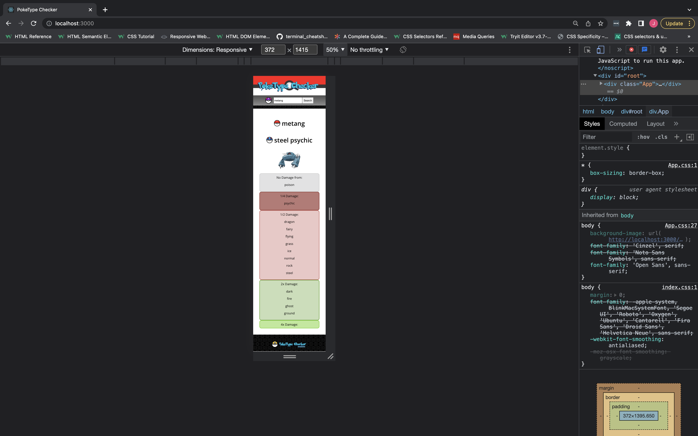
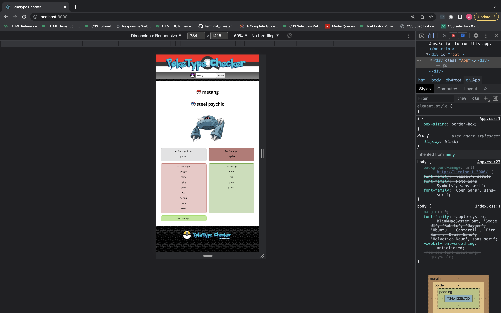
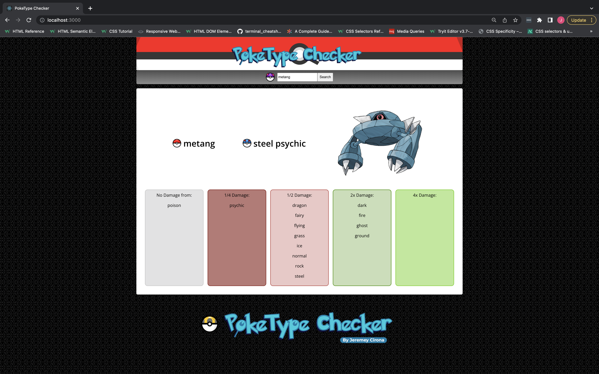

# PokeTypeChecker
- PokeTypeChecker is an app designed for users who are tired of having to consult confusing charts every time they want to know a particular pokemon's weaknesses and resistances. The user simply searches the desired pokemon's name and they will be given all corresponding weaknessses and resistances in colour coded columns.

# Try the app out here https://poketypechecker.surge.sh/

# Screenshots and Layout

# General Approach
- My general approach to this application was to create a very rough presentation of the final application before tackling the main logic of the program. This took a lot more time than I anticipated so once the logic was behaving correctly I moved on to the HTML and CSS portion, adding any additional changes where required. Once I was happy with the look and function of the app, it was deployed and then tested across multiple devices to ensure function and acceptable responsiveness at different screen sizes.

# Tech Stack Used
- React JS to create our front end. In this instance I used functional components for this application.
- Axios to make asynchronous requests to our API for data.
- HTML/CSS for form and styling of the page.
- Surge used to deploy the application.

## Installing dependencies
- Once you've cloned the files down simply type npm i to install the dependencies to your machine.

# Unsolved Issues and Major Hurdles
- Had an issue with the app not working on mobile devices.The issue ended up being the API only taking requests in all lower case, and mobiles generally having the first letter typed always in upper case. This was fixed with a simple to lower case function on the user input, but took a hot second to step back and realise the error, due to not having developer tools to see the 404 error that would have been thrown from the API request.

- The biggest hurdle I overcame with this application was handling and manipulating the data to get the desired outputs. Once a pokemon had two different types I had to deal with numerous duplicate values across multiple arrays. This required a lot of trial to filter out and ensure we were being left with the correct values in each array.

- Hit a wall involving a TypeError stopping my app rendering anything on the page. The issue came about as I was trying to map through an array that on page load was undefined. The data wasn't present until the search button was pressed but since the map method was being run on page load, we couldn't even get a chance to search anything. The problem was rectified by using conditional rendering to check if data was present in the variable before the map method ran.

- I haven't yet implemented a check to let the user know if the pokemon they typed exists or was spelt incorrectly. The current iteration of the app will just do nothing if the pokemon isn't found. Desktop users will see a 404 error in the dev tools if this is the case.

# Future Features
- At the momement the application only outputs text for each type, but I'd like to have each element in the array have a corresponding icon to be rendered instead of plain text. I feel this will improve the appeal and ease of reading with the application.

- User log in and out functionality so a user can log in and potentially put together a hypothetical party of 6 pokemon. They can then check across their party and see which types will give them the most trouble in a battle.
